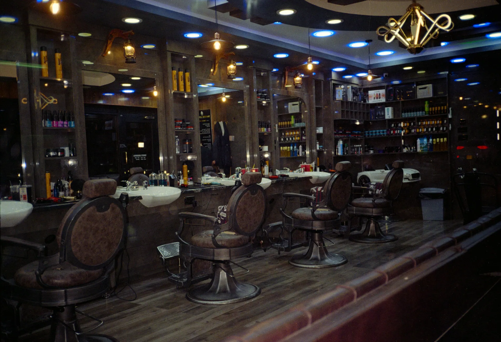

<div align="center">

# ✂️ Talentos Black

**Site institucional de uma barbearia de bairro em Uberlândia (MG):** cardápio de serviços, produtos de balcão, agendamento online e um assistente virtual com IA.




</div>

---

## 📌 Sobre o projeto

A **Talentos Black** é uma barbearia fictícia com identidade urbana: fundo preto, texto creme e um único vermelho de destaque. O site apresenta a casa, os serviços e os produtos. O cliente consegue marcar horário sem sair da página e tirar dúvidas com um assistente virtual que conhece o cardápio, os preços e o funcionamento da barbearia.

O projeto foi construído em cima de um **design system próprio**, documentado antes do código, e usa as versões mais recentes do ecossistema React (Next.js 16, React 19 e Tailwind CSS 4).

> **Nota:** endereço, WhatsApp, nomes dos barbeiros, a história da página `/sobre` e os preços são fictícios.

## ✨ Funcionalidades

| | Funcionalidade | Detalhes |
|---|---|---|
| 💈 | **Cardápio de serviços** | Cortes, barba, combos, tratamentos e adicionais, com filtro por categoria, subcategorias, fotos e selo de recomendação |
| 🧴 | **Produtos de balcão** | Pomadas, shampoos, talcos e cremes vendidos na loja |
| 📅 | **Agendamento** | Assistente em 2 etapas (barbeiro, dia e horário → dados do cliente) com confirmação. Pagamento feito no local |
| 🤖 | **Assistente virtual** | Chat flutuante que responde sobre horários, preços, serviços, produtos e a história da casa, usando o Gemini |
| 🎬 | **Transições de página** | Efeito "cortina" com a `<ViewTransition>` do React 19 e pré-carregamento das imagens das outras páginas |
| 📱 | **Responsivo** | Layout pensado para celular, com menu mobile no cabeçalho |
| ⚡ | **Imagens otimizadas** | Todas as fotos servidas localmente em WebP, sem depender de CDNs externas |
| 🔒 | **Headers de segurança** | CSP restritiva, HSTS, `X-Frame-Options` e outros, configurados em `next.config.ts` |

## 🗺️ Páginas

| Rota | Conteúdo |
|---|---|
| `/` | Home: hero, serviços em alta, galeria, agendamento e chamada final |
| `/sobre` | História e valores da barbearia |
| `/menu` | Cardápio completo de serviços por categoria |
| `/produtos` | Produtos vendidos no balcão |
| `/api/chat` | Rota `POST` usada pelo assistente virtual |

## 🛠️ Tecnologias

- **[Next.js 16](https://nextjs.org/)** (App Router): roteamento, renderização e a rota de API do chatbot
- **[React 19](https://react.dev/)**: componentes e transições de página com `<ViewTransition>`
- **[TypeScript 5](https://www.typescriptlang.org/)** em modo strict
- **[Tailwind CSS 4](https://tailwindcss.com/)** no modelo CSS-first: os tokens da marca ficam no bloco `@theme` de `app/globals.css`
- **[Activepieces](https://www.activepieces.com/) + [Gemini](https://ai.google.dev/)**: orquestração e modelo de linguagem do assistente virtual
- **ESLint 9** com `eslint-config-next`

## 🤖 Como funciona o assistente virtual

```
ChatWidget  ──►  /api/chat  ──►  Webhook do Activepieces  ──►  Gemini
 (cliente)       (Next.js)        (fluxo de automação)         (resposta)
```

A rota `/api/chat` valida a pergunta, monta uma base de conhecimento a partir dos arquivos em `data/` (serviços, preços, produtos, horários, endereço e história) e envia tudo para um fluxo no Activepieces, que consulta o Gemini. Como o contexto vem dos mesmos dados que alimentam o site, o bot acompanha qualquer mudança no cardápio sem ajuste manual.

O guia de configuração do fluxo está em [`docs/chatbot/ACTIVEPIECES.md`](./docs/chatbot/ACTIVEPIECES.md).

## 🎨 Design system

Toda a interface segue o design system documentado em [`docs/design/`](./docs/design/README.md), criado a partir de um mockup de referência:

| Cor | Hex | Uso |
|---|---|---|
| ⬛ Preto | `#000000` | Fundo principal e títulos |
| 🟫 Creme | `#F5F1E8` | Texto sobre o escuro e fundos secundários |
| 🟥 Vermelho | `#E63946` | Chamadas para ação e destaques |

A tipografia combina **Inter** e **JetBrains Mono**. O modo escuro é a apresentação principal da marca. A documentação cobre paleta, tipografia, tokens, componentes, padrões de página e guia de escrita.

## 🚀 Rodando localmente

**Pré-requisitos:** Node.js 20+ e npm.

```bash
# 1. Clone o repositório
git clone https://github.com/Pedrosjm12/Barbearia.git
cd Barbearia

# 2. Instale as dependências
npm install

# 3. Inicie o servidor de desenvolvimento
npm run dev
```

Acesse [http://localhost:3000](http://localhost:3000).

O site funciona **sem banco de dados e sem variáveis de ambiente**. Os agendamentos ficam no `localStorage` do navegador e a ocupação dos horários é simulada.

### Habilitando o chatbot (opcional)

Copie `.env.example` para `.env.local` e preencha:

```env
CHATBOT_WEBHOOK_URL=   # URL do webhook do fluxo no Activepieces (terminando em /sync)
CHATBOT_WEBHOOK_TOKEN= # Segredo compartilhado com o fluxo
```

Sem essas variáveis o widget continua visível, mas avisa que o chat não está configurado.

### Scripts

| Comando | Descrição |
|---|---|
| `npm run dev` | Servidor de desenvolvimento |
| `npm run build` | Build de produção |
| `npm run start` | Serve o build de produção |
| `npm run lint` | Verificação com ESLint |

## 📁 Estrutura

```
barbearia/
├── app/              # Rotas (App Router), layout global, estilos e API do chatbot
├── components/       # Componentes por área: booking, chat, home, menu, produtos, ui...
├── data/             # Conteúdo do site: serviços, produtos, agenda, fotos e história
├── lib/chatbot/      # Montagem da base de conhecimento do assistente
├── docs/
│   ├── design/       # Design system (fonte de verdade da UI)
│   └── chatbot/      # Guia do fluxo no Activepieces
└── public/images/    # Fotos em WebP
```

Detalhes sobre a arquitetura, o modelo de dados e as convenções estão em [`ARCHITECTURE.md`](./ARCHITECTURE.md).

## 🧑‍💻 Para quem for contribuir

- Leia o [`ARCHITECTURE.md`](./ARCHITECTURE.md) antes de mudanças não triviais.
- Não introduza cor, fonte, espaçamento ou componente fora do design system: estenda a documentação em `docs/design/` primeiro.
- Este projeto usa versões do Next.js, React e Tailwind com mudanças incompatíveis com as anteriores. Consulte o [`AGENTS.md`](./AGENTS.md) e a documentação em `node_modules/next/dist/docs/` antes de escrever código do framework.
- O subagent `design-enforcer` (`.claude/agents/design-enforcer.md`) audita a UI contra o design system quando o projeto é desenvolvido com o Claude Code.

## 📸 Créditos

As fotos são do [Unsplash](https://unsplash.com/), com os créditos listados no rodapé do site e em `data/photos.ts`.

---

<div align="center">

Desenvolvido por **[Pedro](https://github.com/Pedrosjm12)**

</div>
